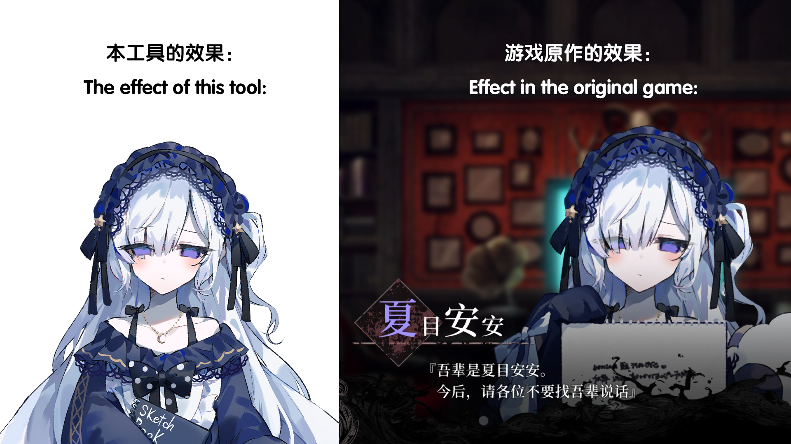

# Manosaba-character-extracter

[](/README.en.md)
[-README-red)](/README.md)

A tool for extracting character sprites from **"魔法少女ノ魔女裁判" (Manosaba)** Unity bundle files. Supports automatic component detection, direct sprite export, and full character compositing.

## Features

- **Auto Detection** — Analyzes bundles for `SpriteRenderer` + `Transform` component data
- **Two Modes**:
  - No component data → exports all sprites as PNG
  - Has component data → choose between direct export or character compositing
- **Selected Sprite List** — Right panel displays filenames of all checked sprites in real time
- **Live Preview** — Auto-composites preview when toggling parts (500ms debounce)
- **Part Selection** — Parts grouped by category with thumbnail previews; Select All / Deselect All
- **Character Compositing** — Assembles full character image by position and sorting depth
- **Hierarchy Viewer** — TreeView displays component hierarchy
- **Progress Bar** — Shows real progress percentage for all time-consuming operations (loading, exporting, compositing)
- **Multi-language Support** — Simplified Chinese / English / fiXmArge (conlang); auto-detects system language
- **Cache Reuse** — Extracted data cached in `temp/`; re-loading a character skips re-extraction
- **Clear Cache Button** — One-click cache cleanup to free disk space
- **RGBA Color Support** — Per-part `m_Color` (RGBA) applied during compositing
- **Adaptive Layout** — All panels remain usable and scrollable when window is resized
- **Path Memory** — Remembers last selected game directory
- **Custom Output Path** — `--output` argument to specify output directory

## Requirements

- Python 3.10+
- Dependencies listed in [`requirements.txt`](requirements.txt)

```bash
pip install -r requirements.txt
```

### Adding a New Language

Edit `src/i18n.py`:
1. Define a language constant (e.g. `LANG_JP = "ja_JP"`)
2. Add it to `LANGUAGE_CODES`
3. Add translations for every key
4. Add a `lang.ja_JP` display name

> The language dropdown auto-generates from `LANGUAGE_CODES` — no `run.py` changes needed.

## Platform Compatibility

This project is primarily developed and tested on **Windows**. It has **not been thoroughly tested on other operating systems**.

- **Windows 10/11**: Primary development and testing platform — fully functional.
- **Linux**: Compatibility unknown. Tkinter and UnityPy may behave differently.
- **macOS**: Compatibility unknown. GUI and file path handling may have issues.

If you successfully run into issues on non-Windows platforms, feel free to open an Issue or Pull Request.

## Usage

### Basic
```bash
python run.py
```

### Command-line Arguments

```bash
python run.py --help
```

| Argument | Description |
|----------|-------------|
| `-h`, `--help` | Show help message |
| `-c`, `--clean` | Clear the output folder before startup |
| `-o <path>`, `--output <path>` | Specify output directory (absolute or relative to script root) |
| `--clear-cache` | Clear the cache folder and exit (without launching GUI) |
| `--git-clean` | Remove `output/` and `temp/` directories and exit (for git commit cleanup) |

**Examples:**
```bash
# Show help
python run.py --help

# Clear default output and start
python run.py --clean

# Custom output path
python run.py --output D:/game_exports

# Clear cache only, no GUI
python run.py --clear-cache

# Cleanup for git commit
python run.py --git-clean

# Combined
python run.py -c -o E:/exports
```

### Workflow

1. Click **Load Game Directory** → select the game root or `characters` folder
2. Click a character in the left character list
3. The tool auto-detects the bundle type:
   - **No component data** → confirmation dialog, then exports all sprites
   - **Has component data** → dialog asking how to proceed
4. When **Composite Character** is selected:
   - Check/uncheck parts in the **Part Selection** tab
   - The **Selected Sprites** panel lists all checked part filenames
   - Enable **Auto Update** for real-time composite preview
   - Click **Generate Composite** to manually composite
   - Click **Save Composite** to export PNG

### Directory Structure

```
project root/
├── output/                ← Final composite images (user-saved)
│   └── <character>_composite.png
├── temp/                  ← Sprite cache (manual clear via button, speeds up re-loads)
│   └── <character>/
│       ├── character_data.json   ← Hierarchy + part data
│       └── sprites/
│           ├── ArmL01.png
│           ├── Body.png
│           └── ...
├── src/                   ← Source code
├── run.py                 ← Main entry point
└── ...
```

> `temp/` is an auto-generated cache folder. It is **not** deleted automatically on character switch. Click the **Clear Cache** button on the left panel to free up space.

## Known Issues

### Incomplete Layer Ordering / Clipping Mask Handling

**Description**
The compositing feature cannot fully reproduce the original game's character illustration layering. Some parts (eyes, hair, facial masks) may appear different from in-game rendering.

**Symptoms**
- Layer stacking order inconsistent with the original game
- `ClippingMask` sprites are rendered as visible sprites instead of acting as invisible clipping regions
- Affected parts include: eyes, hair, facial expression components, etc.

**Comparison**

Below is a comparison between the original game render (right) and the current compositor output (left):



**Root Cause**
The game uses Unity's `SpriteRenderer` + `ClippingMask` mechanism for complex layer clipping. The current compositor only stacks layers by `sorting_order`. The following features are not yet implemented:

1. **Clipping Mask**: `ClippingMask` sprites should act as invisible clipping regions, not be rendered directly
2. **Mask Scope**: Each `ClippingMask` should only affect parts within its specific range (e.g., a `Facial` mask only clips facial parts)
3. **Transparent Masks**: Some masks have `color.a < 1.0` transparency that must be handled

**Workaround**
1. Export all sprites directly and manually edit them using image editing software such as **Adobe Photoshop**.
2. Awaiting future fix.

## Project Structure

| File | Description |
|------|-------------|
| `run.py` | Main entry point (GUI, event handling) |
| `src/__init__.py` | Package init |
| `src/i18n.py` | Internationalization (CN/EN/fiXmArge) |
| `src/bundleloader.py` | Bundle loader (directory search, path memory) |
| `src/compositor.py` | Sprite extraction, detection, compositing |
| `src/tools.py` | Logging utility |

## Tech Stack

- **[UnityPy](https://github.com/K0lb3/UnityPy)** — Unity bundle parsing
- **[Pillow](https://python-pillow.org/)** — Image processing
- **tkinter** — GUI framework

## Credits & License

### Original Game

Extracted content is from **"魔法少女ノ魔女裁判" (Manosaba)**  
© 2024 **Re,AER LLC. / Acacia** — All rights belong to the original developers.

### Tool Author

**paliku520 (云野 风云)** — Development and maintenance

### Technical Credits

This project is a **deep refactor and performance-optimized version** of [KabeNaki](https://github.com/lingk7/KabeNaki) by [lingk7](https://github.com/lingk7).

**Refactoring highlights:**
- **Architecture**: Monolithic file split into modular design (`bundleloader`, `compositor`, `tools`, `i18n`)
- **Performance**: Optimized UI responsiveness; eliminated unnecessary full-UI rebuilds
- **Features Added**: Multi-character management, batch scanning, path memory, hierarchy TreeView, multi-language i18n, cache reuse, RGBA color support

### License

Licensed under **GPL-3.0**. See [LICENSE](LICENSE) for details.

---

**Disclaimer**: For learning and personal research purposes only. All extracted content is owned by the original game developers.
