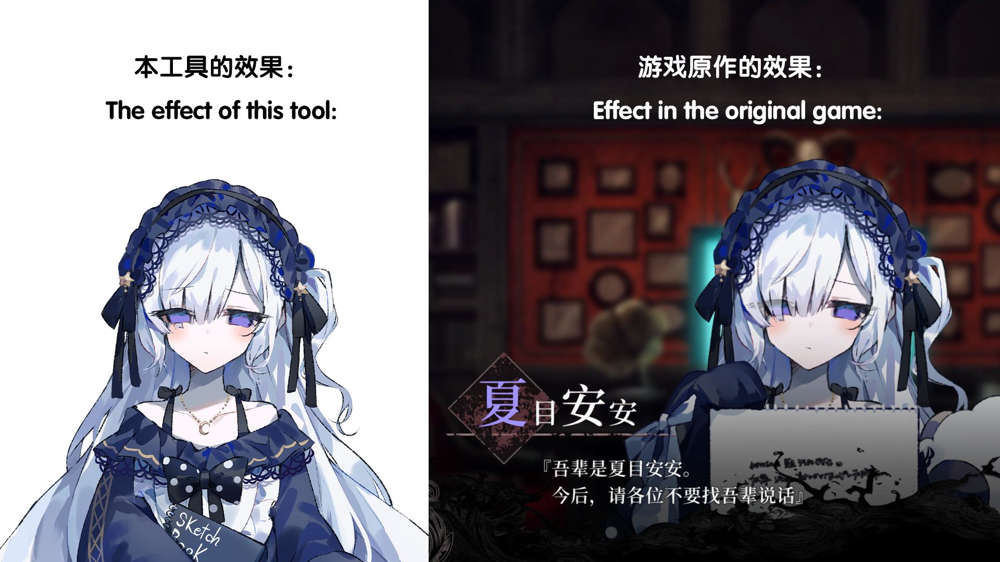

# Manosaba-character-extracter

[](/docs/README.en.md)
[-README-red)](/README.md)

Extract character sprites from Unity bundle files of the game **"Mahou Shoujo no Majo Saiban" (Manosaba)**. Supports automatic component data detection, direct sprite export, and full character illustration compositing.

## Features

- **Auto Detection** — Analyzes whether a bundle contains `SpriteRenderer` + `Transform` component data
- **Two Modes**:
  - No component data → Directly export all sprites as PNG
  - With component data → Choose to export directly or composite the character image
- **Selected Sprite List** — Right panel displays checked sprite filenames in real-time
- **Live Preview** — Automatically composites a preview when toggling parts (500ms debounce)
- **Part Selection** — Parts grouped by category with thumbnail previews, supports select all / deselect all
- **Character Illustration Compositing** — Composites full character images based on component positions and sorting depth
- **Hierarchy Viewer** — TreeView displaying the character component hierarchy
- **Progress Bar** — All time-consuming operations (loading, exporting, compositing) show real progress percentages
- **Multi-language Support** — Built-in Simplified Chinese / English / fiXmArge (fictional language), auto-follows system language
- **Cache Reuse** — Extracted character data is cached in the `temp/` directory, re-loading does not require re-unpacking
- **Clear Cache Button** — One-click cache clearing to free up disk space
- **Responsive Layout** — All panels remain usable when the window is resized, scrollbars always visible
- **Path Memory** — Automatically remembers the last selected game directory
- **Custom Output Path** — Supports command-line argument to specify output directory, flexible for workflow integration

## Requirements

- Python 3.10+
- Dependencies listed in [`requirements.txt`](requirements.txt)
### Install Dependencies
```bash
pip install -r requirements.txt
```
### Adding a New Language

To add a new language, edit `src/i18n.py`:
1. Define a language constant (e.g. `LANG_JP = "ja_JP"`)
2. Add it to the `LANGUAGE_CODES` list
3. Add translations for each key in that language
4. Add a `lang.ja_JP` display name entry

> The dropdown menu is automatically generated from `LANGUAGE_CODES`, no need to modify `run.py`.

## Platform Compatibility

This project is primarily developed and tested on **Windows**. It has **not been fully tested on other operating systems**.

- **Windows 10/11**: Primary development and testing platform, fully functional.
- **Linux**: Compatibility unknown; Tkinter and UnityPy may behave differently on Linux.
- **macOS**: Compatibility unknown; UI and file path handling may have issues.

If you successfully run it on a non-Windows platform or encounter any issues, feel free to submit an Issue or Pull Request sharing your experience.

## Usage

### Basic Usage
```bash
python run.py
```
### Command Line Arguments (also supported in the .exe build)

```bash
python run.py --help
```

| Argument | Description |
|----------|-------------|
| `-h`, `--help` | Show help message |
| `-c`, `--clean` | Clear the output directory (default or custom path) before starting |
| `-o <path>`, `--output <path>` | Specify output directory (supports absolute/relative paths; relative paths are based on the program root) |
| `--clear-cache` | Only clear the cache folder and exit (does not start GUI) |
| `--git-clean` | Clear the `output` and `temp` directories and exit (for cleanup before git commit) |

**Examples:**
```bash
# View help
python run.py --help

# Clear default output directory and start
python run.py --clean

# Specify custom output path
python run.py --output D:/game_exports

# Clear cache only, do not start GUI
python run.py --clear-cache

# Combined usage
python run.py -c -o E:/exports
```
### Workflow

1. Click **Load Game Directory** → Select the game root directory or the `characters` directory
2. Click the character you want to process in the left character list
3. The program automatically detects the bundle type:
   - **No component data** → A dialog confirms, then directly exports all sprites
   - **With component data** → A dialog asks how to proceed
4. After selecting **Composite Character Image**:
   - In the "Part Selection" tab, check/uncheck the parts to include
   - The right "Selected Sprites" panel lists checked part filenames in real-time
   - Enable **Auto Update** for real-time compositing preview
   - Click **Generate Composite Image** to manually composite
   - Click **Save Composite Image** to export as PNG

### Directory Structure

The `output/` structure differs based on character type:

```
program_root/
├── output/                ← Final output directory
│   ├── <name>/            ← No component: sprites flat here
│   │   ├── ArmL01.png
│   │   ├── Body.png
│   │   └── ...
│   └── <name>/            ← With components: organized by type
│       ├── sprites/       ← Exported sprites
│       │   ├── ArmL01.png
│       │   ├── Body.png
│       │   └── ...
│       └── composite/     ← Composite images
│           ├── <name>_composite.png
│           └── ...
├── temp/                  ← Sprite cache directory (can be manually cleared, speeds up re-loading)
│   └── <character_name>/
│       ├── character_data.json   ← Hierarchy + part data
│       └── sprites/
│           ├── ArmL01.png
│           ├── Body.png
│           └── ...
├── src/                   ← Source code directory
├── run.py                 ← Main program entry
└── ...
```

> The `temp/` directory is auto-generated cache. It is not deleted automatically when switching characters. Click the "Clear Cache Folder" button on the left to manually free space.

## Known Issues

### Illustration Compositing Layer Order / Mask Handling Incomplete

**Problem Description**
- The current version of the illustration compositing feature cannot fully reproduce the original game's illustration layer effects. Some character parts (e.g., eyes, hair, face masks) may differ from the in-game display after compositing.

**Specific Symptoms**
- Some layer stacking orders are inconsistent with the original game
- ClippingMask layers are not handled correctly — they are rendered as normal sprites instead of invisible clipping regions
- Affected character parts include but are not limited to: eyes, hair, facial expression parts, etc.

**Comparison**

Below is a comparison between the current compositor output (left) and the original game (right):



**Root Cause Analysis**
- The game's character illustrations use Unity's `SpriteRenderer` + `ClippingMask` mechanism for complex layer clipping effects. The current compositor only performs simple layer stacking based on `sorting_order`, without implementing the following:

1. **Clipping Mask**: `ClippingMask`-type sprites are used to clip the display region of target layers
2. **Mask Scope**: Each `ClippingMask` only affects specific parts within a range (e.g., `ClippingMask_Eyes` only affects the eye area), not globally
3. **Transparent Masks**: Masks have a `color.a < 1.0` transparency property that needs proper handling

**Workarounds**
1. Export all sprite files directly and manually edit them using image editing software such as Adobe Photoshop.
2. Use the [Manosaba mod](http://manosabamoddoc.fuyumi.xyz/) by [雪莉苹果汁](https://space.bilibili.com/3546949672241842) on Bilibili, which allows editing directly within the game (the tool provides component structure information).
3. Wait for future fixes.

## Project Structure

```
project_root/
├── run.py                       # ★ Main entry (GUI + event handling)
├── requirements.txt             # Python dependencies
│
├── src/                         # ── Core Modules ──
│   ├── __init__.py
│   ├── bundleloader.py          # Bundle file searching & loading
│   ├── compositor.py            # Sprite extraction / component detection / compositing
│   ├── export_manager.py        # Sprite export & composite save (directory routing)
│   ├── cache_manager.py         # Cache read/write & integrity validation
│   ├── i18n.py                  # Internationalization (CN/EN/fiXmArge)
│   ├── logtools.py              # Logging utilities
│   └── version.py               # Software version configuration
│
├── src/                         # ── UI Modules ──
│   ├── ui_builder.py            # UI construction (main layout, tabs)
│   └── ui_helpers.py            # UI utilities (progress, preview, hierarchy tree)
│
├── scripts/                     # ── Build Scripts ──
│   └── build_exe.py             # PyInstaller packaging script
│
├── output/                      # ★ Final output (generated at runtime)
├── temp/                        # ★ Sprite cache (generated at runtime)
│
├── .gitignore
├── LICENSE
└── README.md
```

## Tech Stack

- **[UnityPy](https://github.com/K0lb3/UnityPy)** — Unity bundle parsing
- **[Pillow](https://python-pillow.org/)** — Image processing and compositing
- **tkinter** — GUI framework

## Acknowledgments & License

### Original Game Info

The content extracted by this tool is from the game **"Mahou Shoujo no Majo Saiban" (Manosaba)**  
© 2024 **Re,AER LLC. / Acacia** — All rights reserved by the original game developer.

### Author

**paliku520 (Yunye Fengyun)** — Development and maintenance

### Technical Acknowledgments

This project is a **deep refactoring and performance-optimized version** of the [KabeNaki](https://github.com/lingk7/KabeNaki) project. Special thanks to the original project author [lingk7](https://github.com/lingk7) for their outstanding work.

**Refactoring and optimizations include:**
- **Architecture Refactoring**: Split the original monolithic file into a modular design (`bundleloader`, `compositor`, `tools`, etc.) for improved maintainability.
- **Performance Optimization**: Optimized UI responsiveness and data processing flow, eliminating unnecessary full UI rebuilds.
- **Feature Enhancements**: Added multi-character management, batch directory scanning, path memory, TreeView hierarchy, multi-language support, and cache reuse.

---

## Packaging as EXE

The project provides build scripts to package the program into a Windows executable using [PyInstaller](https://pyinstaller.org/).

### Prerequisites

```bash
pip install pyinstaller
```

### Build Scripts

Build script is located in the `scripts/` directory:

```bash
python scripts\build_exe.py --help
```

### Command Line Arguments

| Argument | Description |
|----------|-------------|
| `--onefile` | Package as a single exe (slower startup, better for distribution) |
| `--name <name>` | Custom output exe name (default: `SpriteTool`) |
| `--icon <path>` | Custom icon (.ico format) |
| _(auto clean)_ | Automatically clean `dist/` and `build/` before building (with confirmation) |
| `-h`, `--help` | Show this help message |

### Usage Examples

```bash
# Default packaging (onedir mode, fast startup)
python scripts\build_exe.py

# Package as single exe (onefile mode)
python scripts\build_exe.py --onefile

# Custom name and icon
python scripts\build_exe.py --name MyApp --icon icon.ico
```

### Packaging Modes

| Mode | Startup Speed | Output Structure |
|------|---------------|-----------------|
| `--onedir` (default) | **Fast** (no extraction) | `dist\NAME\NAME.exe` + `_internal\` folder |
| `--onefile` | Slower (extracts on each run) | `dist\NAME.exe` (single file) |

### Notes

- **Icon files** must be in `.ico` format. Convert a PNG using Pillow:
  ```bash
  python -c "from PIL import Image; Image.open('icon.png').save('icon.ico', format='ICO', sizes=[(256,256)])"
  ```
- Dependencies like **UnityPy** are bundled via `--collect-all` to avoid runtime `ModuleNotFoundError`.

### Troubleshooting

| Issue | Solution |
|-------|----------|
| `No module named 'UnityPy.resources'` at startup | Rebuild with `--collect-all UnityPy` (already included in scripts) |
| `fmod.dll` or `archspec` related errors | Rebuild with `--collect-all fmod_toolkit` / `--collect-all archspec` (already included) |
| `output/` or `temp/` folders appear in temp directory | Fixed: paths now resolve to the exe's location automatically |

## .gitignore

The project includes a `.gitignore` file that filters the following directories and files:

| Rule | Description |
|------|-------------|
| `dist/`, `build/` | PyInstaller build output |
| `*.spec` | PyInstaller configuration files |
| `output/`, `temp/` | Runtime-generated directories |
| `*.log` | Log files |
| `__pycache__/`, `*.py[cod]` | Python cache |
| `venv/`, `.venv/`, `.env` | Virtual environments and env files |
| `.vscode/`, `.idea/` | Editor configuration |
| `.*_config.json` | User path memory configuration |

### License

This project is licensed under the **GPL-3.0 License**. See the [LICENSE](LICENSE) file for details.

---

**Disclaimer**: This tool is intended for learning and personal research purposes only. The copyright of the extracted content belongs to the original game developer.
